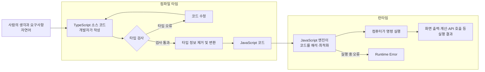

# 2장 타입

## 2.1 타입이란

### 정적 타입과 동적 타입

- 정적 타입 언어는 컴파일 타임에 변수의 타입이 결정되므로, 실행 전에 타입 오류를 발견할 수 있다.
- 동적 타입 언어는 런타임에 변수의 타입이 결정된다. 자유롭게 코드를 작성할 수 있지만 예상하지 못한 타입의 값이 들어오면 실행 중에 오류가 발생할 수 있다.
- 컴파일 타임은 소스코드를 컴퓨터가 실행할 수 있는 형태로 변환하는 시점이고, 런타임은 변환된 코드가 실제로 실행되는 시점이다.



### 타입스크립트의 컴파일

- 일반적인 컴파일은 고수준 언어를 저수준 언어나 기계어로 변환하는 과정이다.
- 타입스크립트에서 컴파일 타임의 결과물은 기계어가 아니라 타입 정보가 제거된 자바스크립트다. 이 자바스크립트를 런타임에 자바스크립트 엔진이 해석하고 실행한다.
- 타입스크립트의 타입은 컴파일 과정에서 제거되며 런타임에는 남지 않는다.
- 즉 타입스크립트는 자바스크립트에 타입이라는 레이어를 추가해, 자바스크립트에서 런타임에 발생할 수 있는 오류를 컴파일 타임에 미리 발견하도록 돕는 언어라고 볼 수 있다.

## 2.2 타입스크립트의 타입 시스템

### 구조적 서브타이핑

- 타입스크립트는 타입의 이름이 아니라 객체가 가진 구조, 즉 프로퍼티를 기준으로 타입의 호환성을 판단한다.
- 서로 다른 이름으로 선언된 타입이라도 필요한 프로퍼티를 모두 가지고 있다면 호환된다.

```ts
interface Pet {
  name: string;
}

interface Cat {
  name: string;
  age: number;
}

const cat: Cat = { name: "Zag", age: 2 };
const pet: Pet = cat; // 가능

const anotherPet: Pet = { name: "Mong" };
const anotherCat: Cat = anotherPet; // 오류: `age`가 없음
```

- 할당 가능 여부는 오른쪽 값이 왼쪽 타입에서 요구하는 프로퍼티를 모두 제공하는지로 판단한다.
  - `pet = cat`: 왼쪽의 `Pet`은 `name`만 요구한다. 오른쪽의 `cat`에는 `name`이 있으므로 할당할 수 있다. 남는 `age`는 문제가 되지 않는다.
  - `cat = pet`: 왼쪽의 `Cat`은 `name`과 `age`를 모두 요구한다. 오른쪽의 `pet`에는 `age`가 있다고 보장할 수 없으므로 할당할 수 없다.
- 키만 보면 `Cat`의 키 집합이 `Pet`의 키 집합을 포함하지만, 값의 범위로 보면 관계가 반대다. 모든 `Cat` 값은 `Pet`의 조건을 만족하므로 `Cat` 값의 집합이 `Pet` 값의 집합에 포함된다. 따라서 `Cat`은 `Pet`의 서브타입이고 `Cat` 값을 `Pet` 자리에 사용할 수 있다.

### 값과 타입의 구분

- 타입스크립트에는 값 공간과 타입 공간이 따로 존재한다.
- 구조 분해 패턴인 `{ ... }` 내부는 값을 변수에 연결하는 자리다. 따라서 이 안에서 사용하는 `:`는 타입 지정이 아니라 프로퍼티의 이름을 바꾸는 자바스크립트 문법이다.

```ts
function email({ person: recipient }) {
  // `person` 프로퍼티의 값을 `recipient`라는 지역 변수로 받음
  console.log(recipient);
}
```

- 따라서 아래처럼 `person: Person`이라고 작성해도 타입 공간의 `Person`을 가리키지 않는다. 값 공간에서 `person` 프로퍼티의 값을 `Person`이라는 지역 변수에 담는다는 뜻이다.

```ts
function email({ person: Person }) {
  console.log(Person); // `Person`은 타입이 아니라 지역 변수
}
```

- 구조 분해한 매개변수의 타입을 지정하려면 구조 분해 패턴이 끝난 뒤에 객체 전체의 타입을 작성해야 한다.

```ts
function email({
  person,
  subject,
  body,
}: {
  person: Person;
  subject: string;
  body: string;
}) {
  // ...
}
```

- 앞의 `{ person, subject, body }`는 실행할 때 객체에서 값을 꺼내는 구조 분해 패턴이고, 뒤의 `: { person: Person; subject: string; body: string }`는 컴파일할 때 검사할 객체 타입이다.

### enum을 잘 사용하지 않는 이유

- 유니온 타입은 타입 공간에만 존재하지만 `enum`은 값으로도 존재하므로 런타임에 순회하거나 검증할 수 있다. 정의를 한곳에서 관리하고 리팩터링하기 편하다는 장점도 있다.
- 반면 일반적인 타입 선언과 달리 `enum`은 자바스크립트로 컴파일한 뒤에도 객체 형태의 코드가 남는다. 숫자형 `enum`의 리버스 매핑처럼 타입 시스템을 넘어 런타임 동작까지 제공한다.
- 따라서 일부 팀은 “타입을 표현하려고 사용한 문법이 런타임 코드와 동작을 만드는 것”을 어색하게 여기거나, 생성되는 코드와 번들 크기를 고려해 `enum` 대신 유니온 타입이나 `as const` 객체를 사용한다.
- `const enum`은 사용하는 위치에 실제 값이 직접 삽입되기 때문에 별도 객체가 남지 않는다. 대신 런타임에 전체 enum을 순회하거나 네임스페이스에 접근할 수 없고, 일부 빌드 설정이나 도구와 호환되지 않을 수 있다.
- 결국 `enum` 사용 여부는 정답의 문제라기보다 런타임 객체가 필요한지, 순회가 필요한지, 빌드 환경과 팀의 기준이 무엇인지에 따라 달라진다.

> TODO: 우리 회사에서 `enum`, `const enum`, 유니온 타입을 사용하는 사례와 선택 기준 찾아보기

### 타입을 확인하는 방법

- `typeof`와 `instanceof`는 런타임에도 존재하는 자바스크립트 연산자이므로 실제 값을 검사할 수 있다.
- `as`를 사용한 타입 단언은 컴파일러에게 해당 값의 타입을 알려줄 뿐, 실제 값을 변환하거나 런타임 안전성을 보장하지 않는다.
- 따라서 외부에서 받은 `unknown` 값을 단순히 단언하기보다는 실제 검증을 거치는 편이 안전하다.

## 2.3 원시 타입

- `NaN`과 `Infinity`도 `number` 타입에 포함된다.

### symbol

- `Symbol()`은 호출할 때마다 서로 다른 `symbol` 원시 값을 만든다.

```ts
const first: symbol = Symbol("id");
const second: symbol = Symbol("id");

first === second; // false
typeof first; // "symbol"
```

- `symbol`과 `unique symbol`은 런타임에 서로 다른 종류의 값이 아니다. 둘 다 `typeof` 결과가 `"symbol"`인 심벌이다. 차이는 타입스크립트가 값을 얼마나 구체적으로 구분하는지에 있다.
  - `symbol`: 어떤 심벌이든 담을 수 있는 넓은 타입
  - `unique symbol`: 특정 심벌 하나만 나타내는 타입

- `unique symbol`은 특정 값 하나를 나타내야 하므로 다른 심벌로 재할당할 수 없는 `const` 또는 `static readonly` 프로퍼티에만 선언할 수 있다.

```ts
let key: symbol = Symbol("key");
key = Symbol("other"); // 가능: `key`에는 어떤 심벌이든 담을 수 있음

const USER_ID: unique symbol = Symbol("USER_ID");
const ORDER_ID: unique symbol = Symbol("ORDER_ID");

// 타입스크립트는 USER_ID와 ORDER_ID를 서로 다른 타입으로 구분함
```

## 2.4 객체 타입

### `{}` 타입

- `{}` 타입은 프로퍼티가 없는 객체의 모양이 아니라 `null`과 `undefined`를 제외한 모든 값을 의미한다. 따라서 원시 값이나 프로퍼티가 있는 객체도 `{}` 타입에 할당할 수 있다.
- 다만 `{}` 타입에는 구체적인 프로퍼티가 선언되어 있지 않다. 실제 값에 프로퍼티가 있더라도 `{}` 타입으로 보는 동안에는 컴파일러가 그 존재를 보장할 수 없으므로 해당 프로퍼티에 접근하거나 새 프로퍼티를 할당할 수 없다.

```ts
const value: {} = { name: "Mong" }; // 가능
const count: {} = 1; // 가능

value.name; // 오류: 변수의 타입으로 지정한 `{}`에는 `name`이 선언되어 있지 않음
value.age = 2; // 오류: `{}` 타입에는 `age`가 선언되어 있지 않음

const inferredValue = { name: "Mong" };
inferredValue.name; // 가능: 타입 추론으로 `name`이 변수의 타입에 보존됨
```

- 즉 오른쪽 값에는 실제로 `name`이 있지만, `value: {}`라는 타입 표기로 컴파일러에는 그 변수를 `{}` 타입으로만 다루라고 지정했기 때문에 `value`를 통해 `name`을 꺼낼 수 없다. 프로퍼티를 사용하려면 구체적인 객체 타입을 지정하거나 타입 추론을 사용해야 한다.

### type과 interface

- 객체 타입을 정의할 때 `type`과 `interface`를 모두 사용할 수 있지만, 어느 하나가 항상 더 좋은 것은 아니다. 팀마다 기준과 선호가 다르다는 점이 인상 깊었다.
- `interface`는 선언 병합이 가능하고 `extends`, `implements`를 활용할 수 있어 확장 가능한 객체의 구조나 공통 규격을 표현하기 좋다.
- `type`은 유니온 타입과 교차 타입을 조합하거나 computed property를 사용하는 등 더 다양한 형태의 타입을 표현할 수 있다.
- 전역적으로 확장될 수 있는 규격에는 `interface`를, 작은 범위에서 한정적으로 사용하거나 값의 형태를 정의할 때는 `type`을 사용하는 방식도 생각해 볼 수 있다.
- 결국 각 문법의 장단점을 이해한 뒤 사용 목적과 팀 컨벤션에 맞게 선택하는 것이 중요하다.

> TODO: 우리 팀에서는 `type`과 `interface`를 각각 어떤 상황에 사용하는지, 정해진 컨벤션이 있는지 확인해서 정리하기
