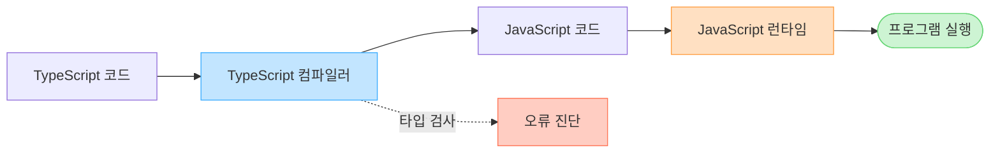
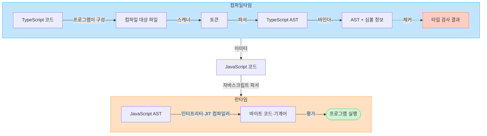

# 6장 타입스크립트 컴파일

이번 장의 핵심은 타입스크립트 코드가 자바스크립트로 변환되고 실행되는 전체 과정이다.



이 흐름은 크게 **컴파일타임**과 **런타임**으로 나뉜다.

- 컴파일타임: 타입스크립트 코드를 검사하고 자바스크립트 코드로 변환하는 과정
- 런타임: 변환된 자바스크립트 코드가 메모리에 적재되어 실제로 실행되는 과정

## 전체 실행 과정



1. 타입스크립트 컴파일러가 타입스크립트 코드를 분석한다.
2. 타입 오류를 검사하고 자바스크립트 코드를 생성한다.
3. 자바스크립트 런타임이 생성된 자바스크립트 코드를 다시 분석한다.
4. 자바스크립트 엔진이 코드를 실행 가능한 형태로 변환하고 평가한다.

## 1단계: 타입스크립트 코드 작성

타입스크립트는 자바스크립트에 정적 타입 문법을 추가한 언어다.

```ts
const name: string = "woowa";
const age: number = 12;
```

웹 브라우저나 Node.js는 타입스크립트 코드를 그대로 실행하지 않는다. 먼저 타입스크립트 전용 문법을 제거하고 자바스크립트 코드로 변환해야 한다.

## 2단계: 타입스크립트 컴파일

타입스크립트 코드는 타입스크립트 컴파일러인 `tsc`를 통해 자바스크립트 코드로 변환된다.

고수준 언어인 타입스크립트를 또 다른 고수준 언어인 자바스크립트로 변환하므로 이 과정을 **트랜스파일**이라고도 한다. 같은 수준의 언어 사이에서 코드를 변환한다는 의미에서 타입스크립트 컴파일러를 **소스 대 소스 컴파일러**라고 부르기도 한다.

### 컴파일러의 두 가지 역할

타입스크립트 컴파일러는 코드 검사기와 코드 변환기의 역할을 한다.

#### 타입 오류 검사

- 프로그램을 실행하기 전에 코드를 정적으로 분석하여 타입 오류를 찾아낸다.
- 자바스크립트에서는 실행해야 발견할 수 있는 오류 중 일부를 컴파일타임에 확인할 수 있다.

```ts
const developer = {
  work() {
    console.log("working");
  },
};

developer.sleep();
// Property 'sleep' does not exist on type '{ work(): void; }'.
```

다만 타입 검사가 실제 런타임 값을 모두 보장하는 것은 아니다. API 응답이나 사용자 입력처럼 런타임에 결정되는 값이 선언된 타입과 다르면, 타입 검사에 통과했더라도 런타임 오류가 발생할 수 있다.

#### 자바스크립트 코드로 변환

- 타입스크립트 문법과 타입 정보를 제거하여 자바스크립트 코드를 생성한다.
- `tsconfig.json`의 `target` 옵션에 따라 최신 자바스크립트 문법을 구버전 문법으로 변환할 수도 있다.

```ts
const welcome = (name: string) => {
  console.log(`Hi, ${name}`);
};
```

`target`을 `ES5`로 설정하면 다음과 비슷한 코드가 생성된다.

```js
var welcome = function (name) {
  console.log("Hi, ".concat(name));
};
```

### 컴파일러 내부의 처리 과정

`tsc`를 실행하면 다음 단계를 거쳐 타입스크립트 코드가 자바스크립트 코드로 변환된다.

```text
tsconfig.json
      ↓
프로그램 → 스캐너 → 파서 → 바인더 → 체커 → 이미터
           토큰      AST      심볼     타입 검사   결과 파일
```

#### 프로그램(Program)

- `tsconfig.json`에 명시된 컴파일 옵션과 대상 파일을 읽는다.
- 진입 파일과 `import` 관계를 따라가며 컴파일에 필요한 소스 파일 전체를 관리한다.

#### 스캐너(Scanner)

- 소스코드를 읽고 **어휘 분석**을 수행한다.
- 소스코드를 의미 있는 최소 단위인 **토큰**으로 나눈다.

```ts
const language = "TypeScript";
```

위 코드는 `const`, `language`, `=`, `"TypeScript"`, `;` 등의 토큰으로 분리된다.

#### 파서(Parser)

- 스캐너가 만든 토큰을 구문적으로 분석한다.
- 분석한 코드의 문법 구조를 **AST(추상 구문 트리)**로 만든다.
- 최상위에는 소스 파일을 나타내는 `SourceFile` 노드가 있고, 그 아래에 변수 선언이나 함수 선언 등의 노드가 연결된다.

```text
SourceFile
└─ VariableStatement
   └─ VariableDeclaration
      ├─ Identifier(language)
      └─ StringLiteral("TypeScript")
```

#### 바인더(Binder)

- AST를 탐색하면서 선언에 대응하는 **심볼**을 생성한다.
- 심볼은 변수, 함수, 클래스, 인터페이스 등 코드에서 선언된 대상의 정보를 나타낸다.
- 선언과 심볼을 연결하고 스코프별 심볼 테이블을 구성하여 같은 이름이 무엇을 가리키는지 알 수 있게 한다.

#### 체커(Checker)

- AST와 바인더가 만든 심볼 정보를 활용해 타입을 검사한다.
- 값이 선언된 타입에 할당될 수 있는지, 존재하지 않는 프로퍼티에 접근하는지 등을 확인한다.
- 발견한 오류는 진단 정보로 수집하여 개발자에게 보여준다.

#### 이미터(Emitter)

- AST를 바탕으로 자바스크립트 등의 결과 파일을 생성한다.
- 컴파일 옵션에 따라 다음과 같은 파일을 만들 수 있다.
  - `.js`: 실행할 자바스크립트 파일
  - `.d.ts`: 타입 선언 파일
  - `.js.map`: 원본 타입스크립트와 생성된 자바스크립트를 연결하는 소스맵

### 타입 검사와 코드 변환은 독립적이다

타입 검사와 자바스크립트 코드 생성은 서로 독립적으로 동작한다. 기본적으로 타입 오류가 있어도 자바스크립트 파일은 생성될 수 있다.

```ts
const age: number = "twelve";
// 타입 오류가 발생하지만 JavaScript 파일은 생성될 수 있다.
```

타입 오류가 있을 때 결과 파일을 생성하지 않으려면 `tsconfig.json`에서 `noEmitOnError`를 활성화해야 한다.

```json
{
  "compilerOptions": {
    "noEmitOnError": true
  }
}
```

## 3단계: 자바스크립트 코드 생성

컴파일이 끝나면 타입 표기가 제거된 자바스크립트 코드가 남는다.

```ts
const name: string = "woowa";
const age: number = 12;
```

```js
const name = "woowa";
const age = 12;
```

타입 정보는 컴파일타임에만 사용되며 자바스크립트 코드가 생성될 때 제거된다. 따라서 런타임에는 타입스크립트의 타입이 존재하지 않고, 타입 자체를 런타임 값처럼 사용할 수도 없다.

## 4단계: 자바스크립트 런타임

자바스크립트 런타임은 자바스크립트 코드가 실제로 실행되는 환경이다. 대표적으로 웹 브라우저와 Node.js가 있다.

- 브라우저 런타임은 자바스크립트 엔진뿐만 아니라 웹 API, 콜백 큐, 이벤트 루프, 렌더링 관련 구성 요소 등을 포함한다.
- Node.js도 자바스크립트 엔진과 이벤트 루프를 제공하지만, 브라우저의 웹 API 대신 파일 시스템이나 네트워크처럼 서버 환경에 필요한 API를 제공한다.

런타임에서는 다음 과정이 이루어진다.

1. 자바스크립트 소스코드를 파싱하여 자바스크립트 AST를 만든다.
2. 자바스크립트 엔진이 AST를 바이트 코드 또는 기계어로 변환한다.
3. 변환된 코드를 평가하여 프로그램을 실행한다.

생성된 자바스크립트에는 타입 정보가 없다. 따라서 타입스크립트의 타입 오류가 런타임에서 다시 검사되는 것은 아니다. 변환된 자바스크립트의 실제 값과 동작에 문제가 있을 때 자바스크립트 런타임 오류가 발생한다.

## 핵심 정리

```text
[TypeScript 코드]
        │
        │ 컴파일타임
        │ - 토큰 분리
        │ - AST 생성
        │ - 심볼 연결
        │ - 타입 검사
        │ - 타입 제거 및 코드 변환
        ▼
[JavaScript 코드]
        │
        │ 런타임
        │ - JavaScript AST 생성
        │ - 바이트 코드·기계어 변환
        │ - 코드 평가
        ▼
[프로그램 실행]
```

- 타입스크립트 컴파일러는 타입을 검사하고 자바스크립트 코드를 생성한다.
- 타입 정보는 컴파일 과정에서 제거되므로 런타임에는 존재하지 않는다.
- 타입 검사와 코드 생성은 독립적이므로 타입 오류가 있어도 자바스크립트가 생성될 수 있다.
- 자바스크립트 런타임은 생성된 자바스크립트 코드를 분석하고 실제로 실행한다.
